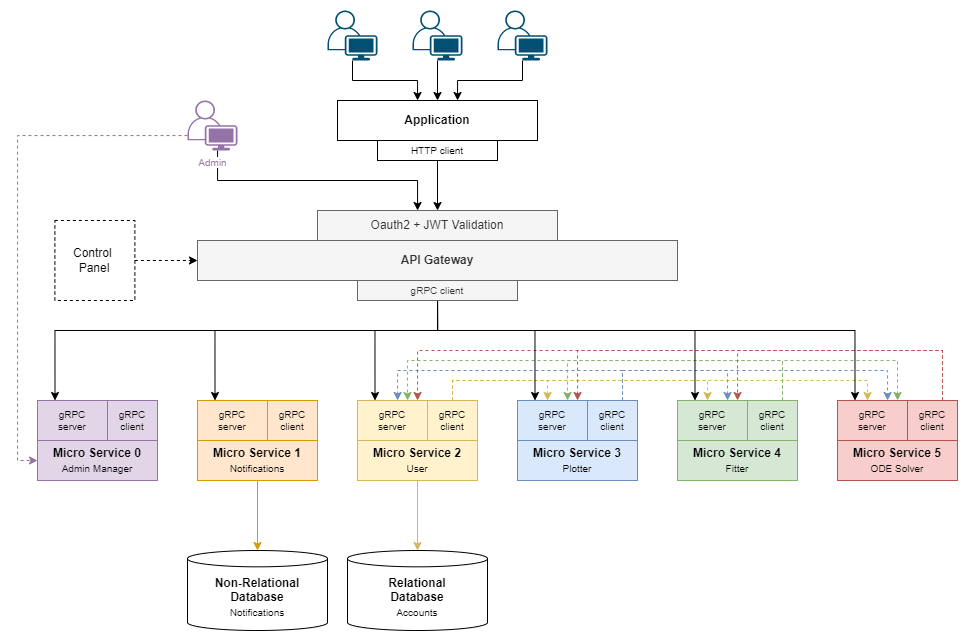

# Lion Of Graphs - Architecture

We define the Lion of Graphs architecture as an integration of the Gateway with an HTTP endpoint that connects the application with all the microservices.

## Tech Stack

As for the technologies stack, check the architecture below.

