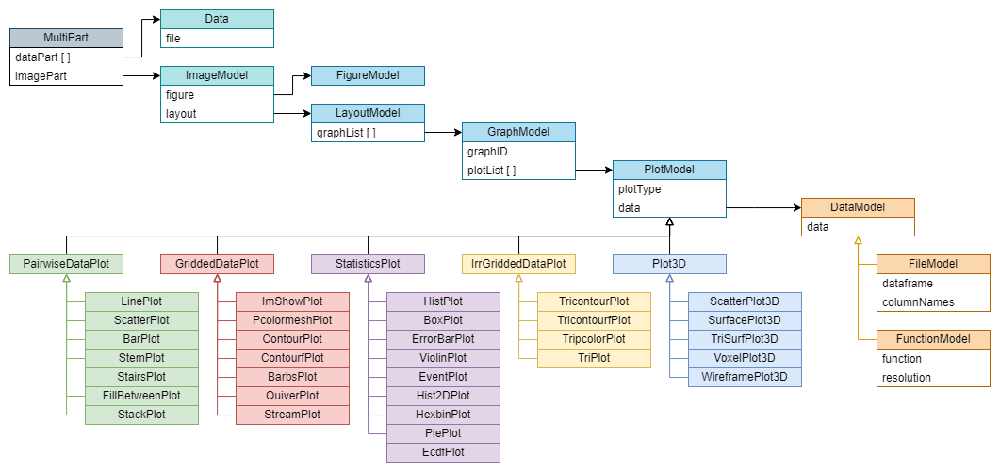

# Data Model

The data model defines the stucture of data within the flow of the services.

## Plotter

Plotter Data Model @ v0.2

PlotModel is based according to the matplotlib lybrary stable@[v3.8](https://matplotlib.org/stable/plot_types/index.html).
